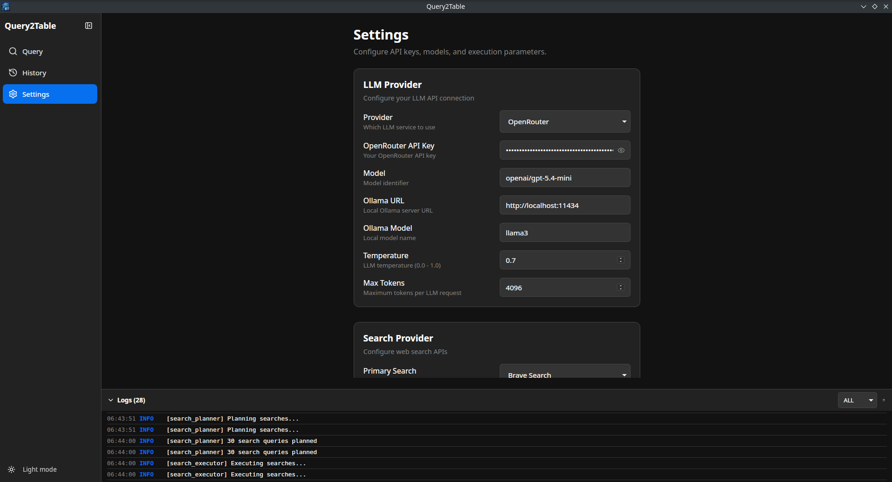
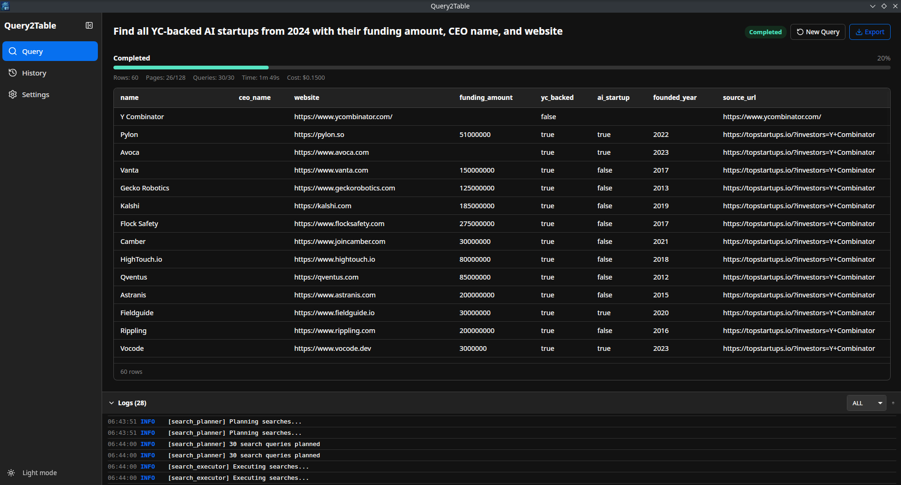

# Query2Table


A local-first desktop application that converts natural-language research queries into structured tables with row-level sources. Built with Tauri v2, Rust, and Svelte 5.

Enter a query like *"Find all YC-backed AI startups from 2024 with their funding amount, CEO name, and website"* and Query2Table will search the internet, extract entities via LLMs, deduplicate results, and present a live-updating table — all running locally on your machine.




## Features

- **Natural language queries** — describe what you want in plain English
- **Automatic schema inference** — the app proposes table columns; you confirm or edit before execution
- **Multi-provider search** — Brave Search + Serper with automatic fallback
- **Multilingual query expansion** — searches across languages and geographies
- **LLM-powered extraction** — OpenRouter (cloud) or Ollama (local) for entity extraction
- **Streaming results** — rows appear in a live table as they're found
- **Row-level sources** — every row links back to the pages it was extracted from
- **Entity deduplication** — fuzzy matching + LLM-assisted disambiguation
- **Configurable stop conditions** — target row count, max cost, max duration
- **Run history** — browse, view, and re-export past research runs
- **Export** — CSV, JSON, XLSX with full source metadata
- **Dark / Light theme** — toggle in the sidebar
- **System tray** — completion notifications
- **Local-first** — all data in SQLite, no cloud backend required

## Tech Stack

| Layer | Technology |
|-------|------------|
| Desktop shell | Tauri v2 |
| Backend | Rust (Tokio async runtime) |
| Frontend | Svelte 5 (SvelteKit SPA) |
| UI framework | Skeleton UI + Tailwind CSS v4 |
| Database | SQLite (sqlx, WAL mode) |
| LLM | OpenRouter (OpenAI-compatible) / Ollama (local) |
| Search | Brave Search API / Serper API |
| Icons | Lucide |

## Prerequisites

- [Node.js](https://nodejs.org/) >= 18
- [Rust](https://www.rust-lang.org/tools/install) (stable toolchain)
- [Tauri v2 prerequisites](https://v2.tauri.app/start/prerequisites/) for your OS

## Getting Started

```bash
# Clone the repository
git clone https://github.com/hightemp/query2table.git
cd query2table

# Install frontend dependencies
npm install

# Run in development mode (starts both Vite dev server and Tauri)
npm run tauri dev

# Build for production
npm run tauri build
```

## Configuration

On first launch the app creates a local SQLite database with default settings. Open **Settings** from the sidebar to configure:

| Group | Settings |
|-------|----------|
| **LLM Provider** | Provider (OpenRouter / Ollama), model, API key, temperature, max tokens |
| **Search Provider** | Provider (Brave / Serper), API key, fallback toggle, results per query |
| **Execution** | Parallel fetches (default 8), parallel extractions (default 3), fetch timeout, rate limiting, robots.txt |
| **Quality** | Precision/recall balance, evidence strictness, confidence threshold, dedup similarity |

Stop conditions (target rows, max cost, max duration) are set per-query on the Query page.

### API Keys

You need at least one search API key and one LLM API key:

| Service | Get a key at |
|---------|-------------|
| Brave Search | https://brave.com/search/api/ |
| Serper | https://serper.dev/ |
| OpenRouter | https://openrouter.ai/ |
| Ollama (local) | https://ollama.com/ — no key needed |

## Architecture

The backend uses a **pipeline state machine** with fixed roles orchestrated in sequence:

```
Query → Interpret → Plan Schema → [User Confirms] → Plan Searches
      → Expand Queries → Execute Search → Fetch Pages → Parse Documents
      → Extract Entities → Validate → Deduplicate → [Stop Check] → Done
```

### Pipeline Roles

| Role | LLM | Purpose |
|------|-----|---------|
| QueryInterpreter | Yes | Parse query into structured intent |
| SchemaPlanner | Yes | Propose table columns and types |
| SearchPlanner | Yes | Generate search queries for multiple languages/geos |
| QueryExpander | Yes | Translate queries into target languages |
| SearchExecutor | No | Call search APIs, collect candidate URLs |
| Fetcher | No | HTTP fetch with rate limiting and robots.txt |
| DocumentParser | No | HTML → clean text (boilerplate removal) |
| Extractor | Yes | Text + schema → structured rows |
| Validator | Partial | Schema conformance + semantic checks |
| Deduplicator | Partial | Fuzzy matching (strsim) + LLM for edge cases |
| StoppingController | No | Evaluate stop conditions (rows, budget, time, saturation) |

### State Machine

```
Pending → SchemaReview → Running ⇄ Paused → Completed / Failed / Cancelled
```

## Project Structure

```
query2table/
├── src-tauri/               # Rust backend
│   ├── src/
│   │   ├── main.rs          # Tauri entry point
│   │   ├── commands/        # IPC command handlers
│   │   ├── orchestrator/    # Pipeline state machine, budget tracker
│   │   ├── roles/           # 11 pipeline roles
│   │   ├── providers/       # External API clients (LLM, search, HTTP)
│   │   ├── storage/         # SQLite models & repository
│   │   └── export/          # CSV, JSON, XLSX export
│   └── migrations/          # SQLite schema migrations
├── src/                     # Svelte frontend
│   ├── lib/
│   │   ├── components/      # UI components
│   │   ├── stores/          # Svelte stores (run, settings, ui, logs)
│   │   ├── types/           # TypeScript type definitions
│   │   └── api/             # Tauri invoke/listen wrappers
│   └── routes/              # Pages (query, history, settings)
├── package.json
└── src-tauri/Cargo.toml
```

## Database

SQLite in WAL mode with the following tables:

| Table | Purpose |
|-------|---------|
| `settings` | User configuration (API keys, models, preferences) |
| `runs` | Research run records with status and stats |
| `run_schemas` | Confirmed table schema per run |
| `search_queries` | Generated search queries per run |
| `search_results` | URLs collected from search APIs |
| `fetched_pages` | Downloaded page content |
| `entity_rows` | Extracted structured rows (JSON data) |
| `row_sources` | Row-level evidence (URL, title, snippet) |
| `run_logs` | Execution logs per run |

## Development

```bash
# Frontend dev server only
npm run dev

# Type checking
npm run check

# Run tests
npm test

# Run Rust tests
cd src-tauri && cargo test

# Lint
npm run lint
```

## Export Formats

| Format | Contents |
|--------|----------|
| **CSV** | All columns + sources as JSON column |
| **JSON** | Full rows with nested sources array and run metadata |
| **XLSX** | Formatted workbook with data sheet, sources sheet, and metadata sheet |

## License

MIT


